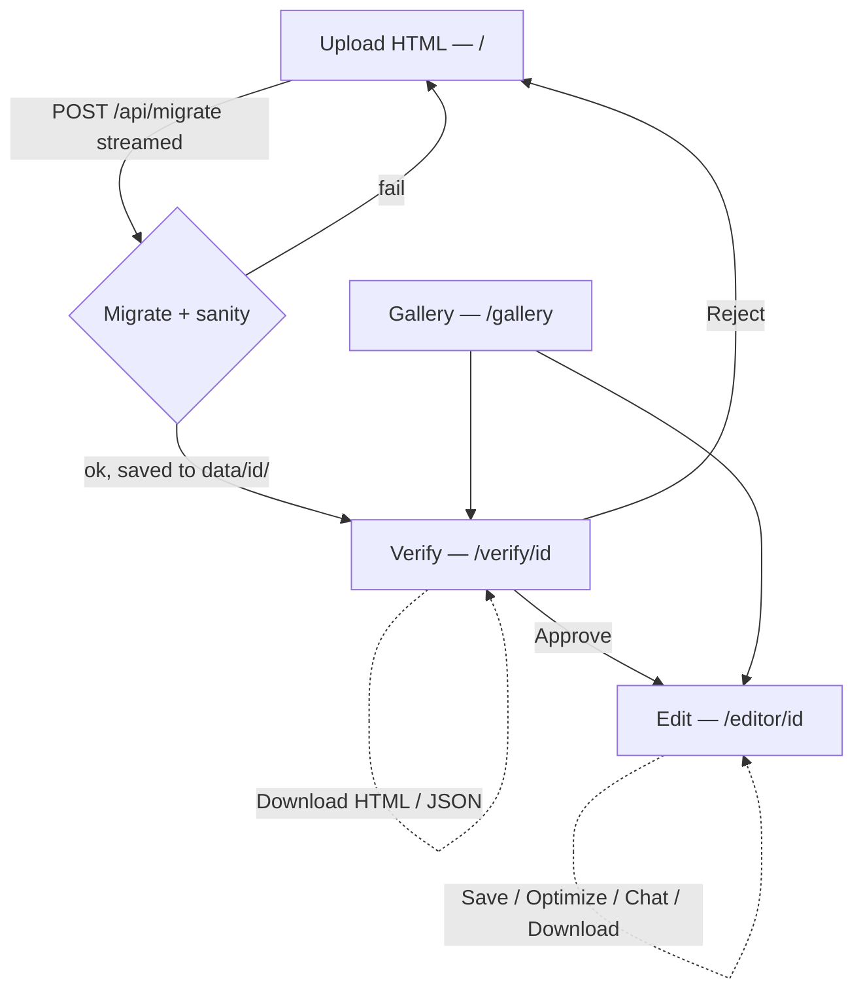

# Application Flow

How **HTML Live Dashboards** turns a static, AI-generated HTML dashboard into a
live, editable one — end to end, with every moving part and where it lives.

---

## 1. The core idea in one paragraph

A generated dashboard is a single self-contained HTML file (inline CSS/JS,
Chart.js, KPI cards, tables). One LLM **migration** call splits it into a
design-only **`template.html`** (every dynamic value replaced with a `data-bind`
/ `data-chart` / `data-table` marker) and an editable **`data.json`** (sheet-style
KPIs, charts, tables, narrative, labels). A tiny deterministic **loader** re-fills
the template from the data at view time, so the result is visually identical to the
original. Everything afterward — verifying, editing, optimizing, chatting — operates
on that template + data pair, and every change is re-validated by deterministic
**sanity checks** before it is persisted.

```
ORIGINAL .html ──(1 LLM migrate call)──▶ template.html  +  data.json
                                              │
                          hydrate(template, data) = loader fills markers
                                              ▼
                                   rendered dashboard ≙ original
```

---

## 2. Lifecycle (screen by screen)



1. **Upload** (`app/page.tsx`) — drop an HTML file. The client streams
   `POST /api/migrate` and shows a live log (status phases + a character counter as
   the model streams). On success it routes to verify.
2. **Verify** (`app/verify/[id]/page.tsx`) — original vs. hydrated template
   side-by-side. **Approve** freezes the migration (status), **Reject** returns.
   Also: a **UI fix-assistant** chat (parity-focused, accepts screenshots) and
   **Download HTML / JSON** buttons.
3. **Edit** (`app/editor/[id]/page.tsx`) — tabbed editor (KPIs · each chart · each
   table · Narrative · Labels) with a live preview. **Save** writes `data.json`;
   **Optimize** dedups keys; a combined **dashboard-assistant** chat handles data +
   UI/interactivity; **Download HTML / JSON**.
4. **Gallery** (`app/gallery/page.tsx`) — every saved dashboard as a card with a
   live thumbnail, status, date and cost, linking into verify or edit.

---

## 3. The migration call (the heart)

`POST /api/migrate` (`app/api/migrate/route.ts`) — streamed NDJSON, runtime
`nodejs`:

1. One streamed DeepSeek completion with the migration system prompt
   (`lib/migrate-prompt.ts`). Output is **sentinel-separated**:
   `===TEMPLATE===` … `===DATA===` …, parsed deterministically by
   `parseSentinels`.
2. `finish_reason === "length"` ⇒ treated as a **failed** migration (never parse a
   truncated template).
3. **Sanity checks** (`lib/sanity.ts`, all deterministic):
   - `data.json` parses + validates against the zod schema (`lib/schema.ts`);
   - bidirectional key integrity — every template marker has a data entry and
     vice versa (no orphans either way);
   - template byte-length stays within a band of the original (catches rewrites);
   - the `#chart-styles` block parses and its keys ⊆ chart keys.
4. On failure: **one repair retry** (re-call with the issue list appended). Still
   failing ⇒ surface the issues, **write nothing**.
5. On success: `saveDashboard(id, …)` writes the four files; rough cost is recorded.

Progress is emitted to the client as `{type: status|progress|done|error}` events.

---

## 4. Data model & binding contract

`data.json` is the storage format — one collection per editor tab
(`lib/schema.ts`):

| Collection | Shape | Template marker |
|---|---|---|
| `kpis[]` | `{key,label,value,format}` | `<span data-bind="kpi:KEY">` |
| `labels[]` | `{key,value}` | `<div data-bind="label:KEY">` |
| `narrative[]` | `{key,label,text,mentions[]}` | `<p data-bind="narrative:KEY">` |
| `charts{}` | `{label,columns[],rows[][]}` | `<canvas data-chart="KEY" data-chart-type="…">` |
| `tables{}` | `{label,columns[],rows[][]}` | `<table data-table="KEY">…<tbody data-table-body>` |

- `format` drives KPI display: `currency:MYR:2`, `percent:1`, `number:0`, `text`.
- Chart **styling** (colors/options) lives in a `#chart-styles` JSON block in the
  template; chart **data** lives in `data.json`. The two are joined at render.
- **Dedup is identity by key**: a repeated value is one entry bound by many markers,
  so one edit updates every location.

---

## 5. Hydration (the runtime loader)

`lib/loader.ts`:

- `LOADER_SCRIPT` — a raw, dependency-free `~60`-line IIFE (authored as a string so
  the exact bytes reach the browser untouched by transpilation). It reads an inlined
  `#ei2-data` JSON block and fills every `data-bind` / `data-table` / `data-chart`
  marker, formatting KPIs and (re)building Chart.js charts with `#chart-styles`.
- `hydrate(template, data)` = pure string concat: inject the data block + loader
  before `</body>`. No server-side DOM work; the template is trusted after approval.

Hydration runs on the server for verify/gallery (`hydrate` in the API) and on the
client for the editor's live preview (recomputed, debounced, on every edit).

---

## 6. Post-migration operations

All three reuse the same safety rule: **the LLM only proposes; changes are applied
deterministically and re-run through `runSanityChecks` before persisting.**

| Feature | Route | What it does |
|---|---|---|
| **Edit / Save** | `PUT /api/dashboards/[id]` | Validate edited `data.json` against the schema, persist, re-hydrate. |
| **Optimize** (editor) | `POST/PUT …/optimize` | POST: LLM **proposes** key-merge groups (duplicate KPIs/labels). PUT: `applyMerges` (`lib/optimize.ts`) rewires the template's `data-bind` keys, drops duplicate entries, sanity-checks, saves. Review-then-apply. |
| **Chat** | `POST/PUT …/chat` | POST: one chat turn (`lib/chat-prompt.ts`). PUT: apply a proposed `template` and/or `data.json`, sanity-gated. |

**Chat focuses** (one component `components/dashboard-chat.tsx`, one route):
- `"ui"` (verify) — scoped strictly to *original vs. generated template*; fixes the
  template (and data when a fix needs it); accepts screenshots; parity-oriented.
- `"editor"` — combined assistant over data **and** the generated HTML's appearance
  + interactivity; may match the original and improve beyond it; emits a corrected
  template and/or `data.json` after `===FIXED_TEMPLATE===` / `===FIXED_DATA===`.

In both cases the assistant is instructed to decline anything unrelated to the
dashboard, and an applied fix that drops a marker, orphans a key, or rewrites the
document is **rejected** by sanity checks, never saved.

---

## 7. Persistence

`lib/store.ts` — plain filesystem (swap for DB columns later in this one file):

```
data/{id}/
  original.html    # the uploaded source
  template.html    # design-only, with markers
  data.json        # editable values
  meta.json        # id, title, sourceFile, status, timestamps, costUsd
```

- `saveDashboard` (migrate), `saveData` (editor save), `saveTemplateAndData`
  (optimize / chat apply), `setStatus` (approve/reject), `listDashboards` (gallery),
  `loadDashboard` (everything). Reads are parallelized; `data/` contents are
  git-ignored.

---

## 8. LLM client & configuration

`lib/deepseek.ts` — the OpenAI SDK pointed at DeepSeek's base URL (lazily
constructed; callers gate on `hasDeepseekKey()`), with a 3-attempt exponential
backoff for 429/5xx. Porting to Anthropic-via-Foundry later changes only this file.

| Env var | Default | Used by |
|---|---|---|
| `DEEPSEEK_API_KEY` | — | all LLM calls (required) |
| `DEEPSEEK_BASE_URL` | `https://api.deepseek.com` | client |
| `DEEPSEEK_MODEL` / `DEEPSEEK_MAX_TOKENS` | `deepseek-v4-flash` / `32000` | migration + optimize |
| `DEEPSEEK_CHAT_MODEL` / `DEEPSEEK_CHAT_MAX_TOKENS` | `deepseek-v4-flash` / `8000` | verify + editor chat |

Without a key the LLM routes return `503` and the rest of the app (verify/edit over
already-migrated dashboards, downloads, gallery) still works.

---

## 9. Module map

```
app/
  page.tsx                      Upload + streamed migration log
  verify/[id]/page.tsx          Side-by-side approval + UI chat + downloads
  editor/[id]/page.tsx          Tabbed editor + preview + optimize + chat + downloads
  gallery/page.tsx              Card grid with live thumbnails
  api/
    migrate/route.ts            POST — streamed migrate + sanity + repair
    dashboards/route.ts         GET  — list metadata
    dashboards/[id]/route.ts    GET (?view=preview) / PUT — load / save data+status
    dashboards/[id]/optimize/   POST propose merges / PUT apply
    dashboards/[id]/chat/       POST chat turn / PUT apply fix
lib/
  deepseek.ts      LLM client, models, backoff
  schema.ts        zod schema for data.json
  migrate-prompt.ts  migration system prompt + sentinel parsing
  sanity.ts        deterministic post-migration checks
  loader.ts        runtime loader (string) + hydrate()
  store.ts         filesystem persistence
  optimize.ts      merge-proposal schema/prompt + deterministic applyMerges
  chat-prompt.ts   ui/editor system prompts + reply parsing
  download.ts      browser download + slugify
  validate-html.ts upload validation
components/
  dashboard-chat.tsx   shared chat bubble (focus = "ui" | "editor")
  ui/*                 shadcn/ui primitives
hooks/
  use-debounced-value.ts   debounced live preview
```

---

## 10. The invariant that makes it safe

> A migrated/edited dashboard is **never** written to `data/` unless its template
> markers and `data.json` keys are in sync and the document wasn't structurally
> rewritten.

Every write path — migrate, save, optimize-apply, chat-apply — funnels through
`runSanityChecks` (or schema validation), so the LLM's freedom is bounded by
deterministic code. That is what lets the LLM propose freely while corruption stays
structurally impossible.
